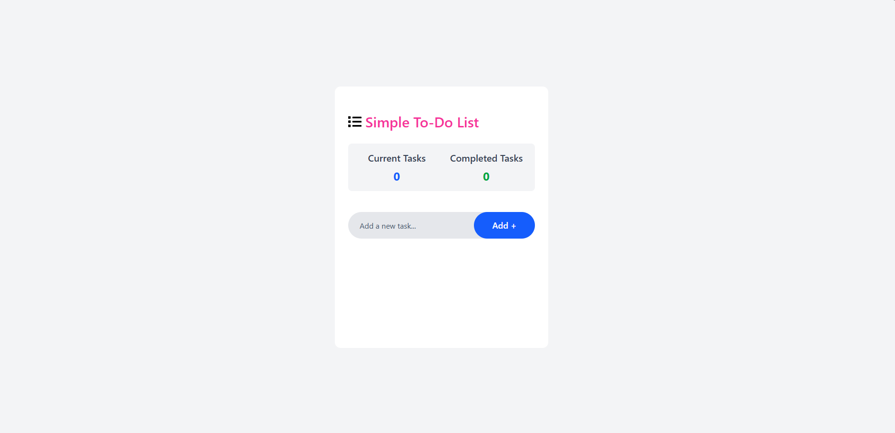
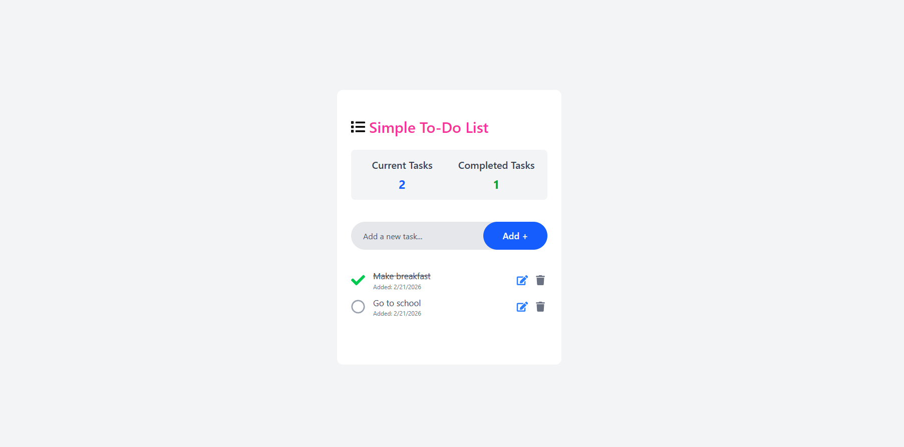

# To-Do App

A modern to-do list project for Software Persona Internship built with React and Vite, featuring CRUD operations, task persistence, and a clean UI with Tailwind CSS.

## Features

- **Add Tasks**: Create new tasks with a maximum of 50 characters.
- **List Tasks**: View all tasks, separated into Current Tasks (total count) and Completed Tasks (completed count).
- **Update Tasks**: Edit task text via a modal popup.
- **Delete Tasks**: Remove tasks individually.
- **Toggle Completion**: Mark tasks as complete or incomplete.
- **Date Added**: Displays the date each task was created.
- **Persistence**: Tasks are saved in localStorage and persist across page refreshes.
- **Responsive Design**: Styled with Tailwind CSS for a modern look.

## Tech Stack

- **Frontend**: React (with Vite)
- **Styling**: Tailwind CSS
- **Icons**: React Icons
- **Deployment**: Netlify [Netlify Link](https://to-do-app-ylmzurs.netlify.app/)

## Installation

1. Clone the repository:
   ```
   git clone <your-github-repo-url>
   ```
2. Navigate to the project directory:
   ```
   cd to-do-app
   ```
3. Install dependencies:
   ```
   npm install
   ```
4. Start the development server:
   ```
   npm run dev
   ```
   Open [http://localhost:5173](http://localhost:5173) in your browser.

## Usage

- Add a new task using the input field and "Add" button.
- Click the checkbox to toggle task completion.
- Click the edit icon to update task text in a modal.
- Click the trash icon to delete a task.
- Tasks persist automatically across page refreshes.

## Project Structure

- `src/components/`: Reusable components (ToDo, TodoItems, TaskLists)
- `src/pages/`: Page-level components (App)
- `src/interfaces/`: (For future TypeScript interfaces, if needed)

## Deployment

- **Live Demo**: [Netlify Link](https://to-do-app-ylmzurs.netlify.app/) 
- **Repository**: [GitHub Link](https://github.com/urasylmaz1/to-do-app) 

## Screenshots




